### `ganler`'s GitHub 
OPINIONS ARE MY OWN

- **HOMEPAGE**: [Jiawei Liu](https://jiawei-site.github.io/)
- **INTEREST**: Programming Systems & Deep Learning

> "ganler" means 甘楽, which is from my favorite animation デュラララ!!(DURARARA!!).

